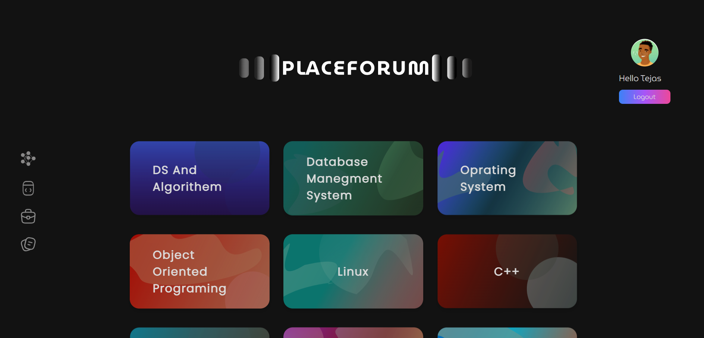
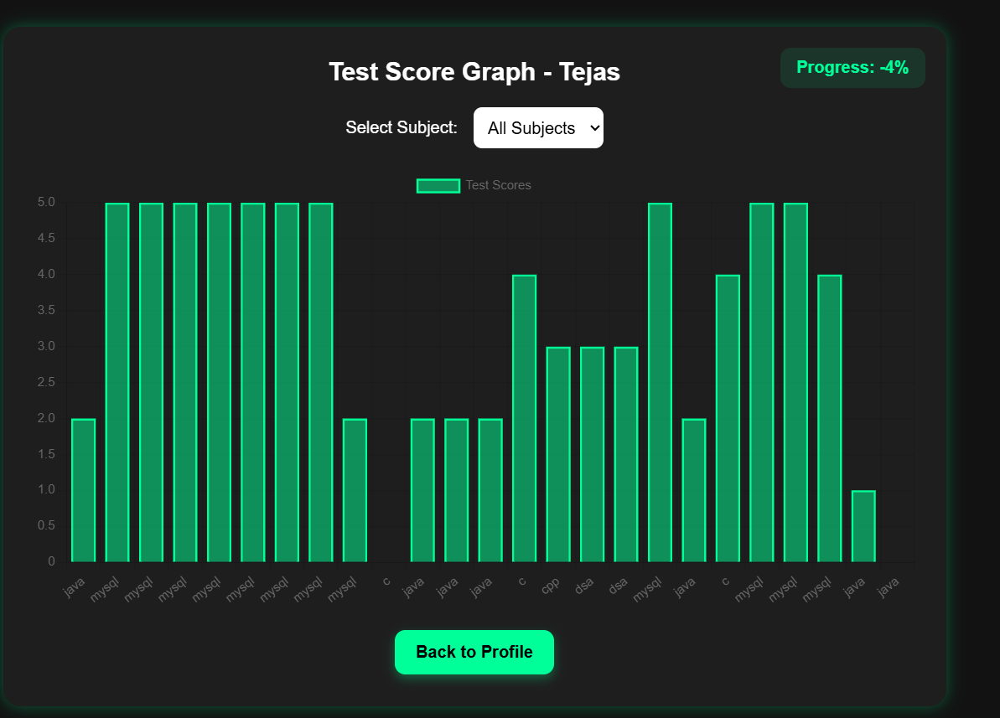
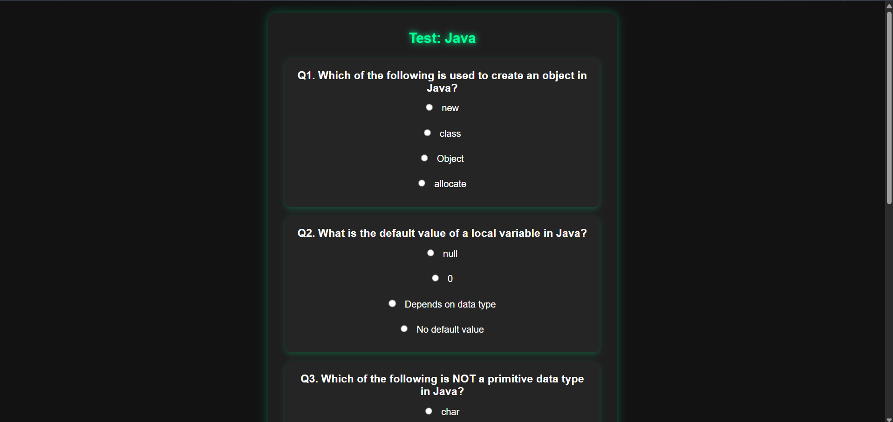
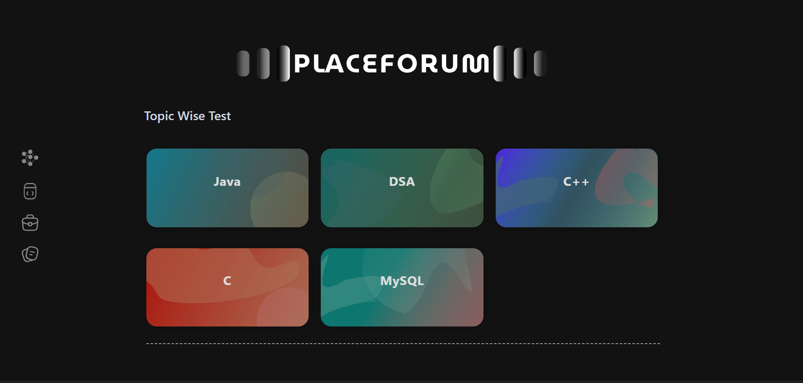
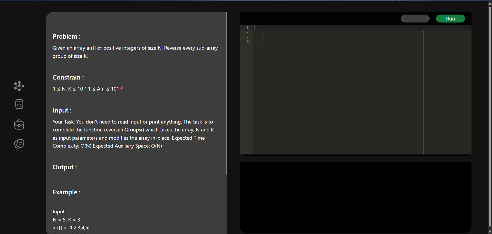
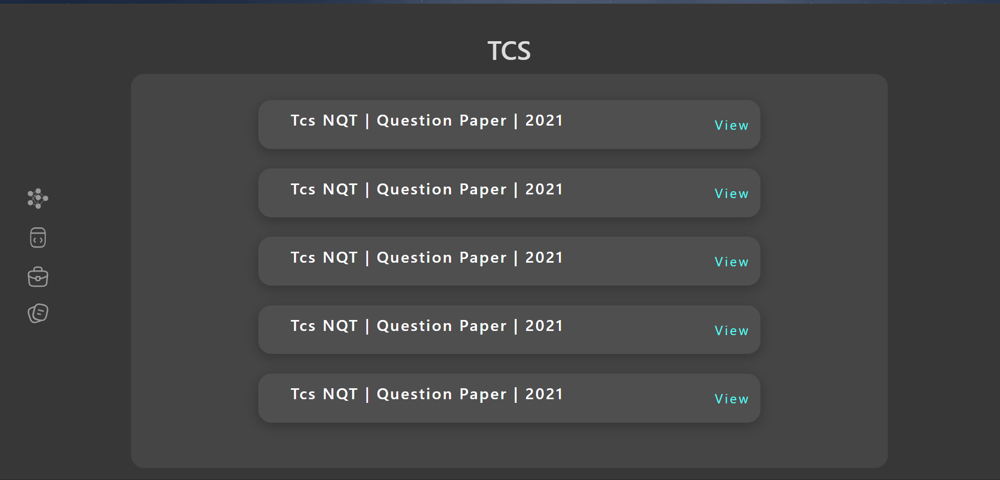
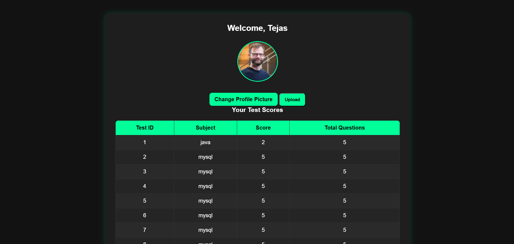

# 🚀 Placement Assist Portal

A full-stack web application designed to help students prepare for placements by providing learning resources, coding practice, aptitude tests, and interview materials.

---

## 📌 Features

* 🔐 User Authentication (Signup/Login with OTP)
* 📚 Video Lectures for learning
* 🧠 Aptitude & MCQ Practice Tests
* 💻 Online Code Editor (Ace Editor)
* 📄 Interview Question Papers
* 👤 User Profile Management
* 🔄 Password Reset System

---

## 🛠️ Tech Stack

* **Frontend:** HTML, CSS, JavaScript
* **Backend:** PHP
* **Database:** MySQL
* **Server:** XAMPP

---

## ⚙️ Installation & Setup

1. Clone the repository:

```bash
git clone https://github.com/TejasDeshmukh17/placement-assist-portal.git
```

2. Move the project to XAMPP directory:

```
C:\xampp\htdocs\
```

3. Start Apache & MySQL using XAMPP

4. Import database:

* Open: http://localhost/phpmyadmin
* Create a database (e.g., `placement_portal`)
* Import `userform.sql`

5. Run the project:

```
http://localhost/placement-assist-portal
```

---

## 📂 Project Structure

* `/app` → Backend logic
* `/controllerUserData.php` → Authentication logic
* `/img` → Images
* `/js` → Scripts
* `/lectures` → Learning resources
* `/papers` → Interview papers
* `/youtube` → Coding practice content

---

## 📸 Screenshots

### 🏠 Homepage



### 🔐 Login Page


### 📊 Dashboard



### 🧠 MCQ Exam



### 📝 MCQ Test



### 💻 Coding Terminal



### 📄 Company Papers



### 👤 User Profile




## ⚠️ Notes

* Large libraries (Ace Editor, vendor files) are excluded using `.gitignore`
* Configure database connection in `connection.php`

---

## 👨‍💻 Author

**Tejas Deshmukh**

* GitHub: https://github.com/TejasDeshmukh17

---

## ⭐ If you like this project

Give it a ⭐ on GitHub!
